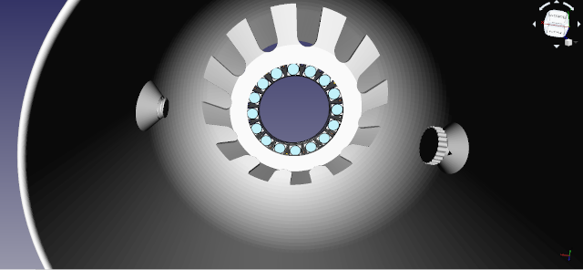

# PicoLeds
Contrôle d'un anneau de 16 leds Neopixels RGB à l'aide d'un micro-contrôleur Raspberry [PICO](https://www.papsdroid.fr/post/hello-pico).
Ce prototype permet de commander les ambiances lumineuses à l'aide d'un bouton poussoir dans le but de fabriquer une petite lampe de chevet aux ambiances sympas.

## prototype

### matériel nécessaire
* 1 Raspberry PICO.
* 2 barettes de pin header 20 broches 2,54mm (inutile si le PICO est acheté avec les barettes déjà soudées).
* 1 anneau de 16 leds Neopixel d'Adafruit, sur lequel il faut souder 3 pin headers sur +VCC, SIGNAL et GND.
* 1 petit bouton poussoir 6mm.
* 2 resistances 10k ohms.
* 1 breadbord et des câbles dupont souples.

### fritzing
Le prototype sur breadboard est simple à réaliser. Il faut souder les pin header 20 broches sur le PICO (ou acheter un PICO avec les pin header déjà soudés). 
J'ai aussi soudé 3 pin sur le ring Neopixel des 16 leds sur le +VCC, SIGNAL et GND afin de pouvoir le positionner sur la breadboard. 
Le bouton poussoir est monté en pull-up avec le jeux de 2 résistances 10k ohms.
Aucun filtrage "RC" n'est nécessaire avec le bouton poussoir car les faux-rebonds electro-mécaniques générés lors des appuis seront filtrés de manière logicielle.

## script MicroPython
Avant d'installer le script micoPython qui gère l'anneau Neopixel il faut d'abord configurer le Raspberry PICO en suivant [ce guide](https://www.papsdroid.fr/post/hello-pico).
Le script **main.py** dans le dossier /microPython est conçu à partir de l'exemple fourni par Raspberry concernant le [SDK microPython](https://datasheets.raspberrypi.org/pico/raspberry-pi-pico-python-sdk.pdf) sur le contrôle Neopixel.
Le bouton poussoir quand à lui est associé à une fonction callback appelée par interruption logicielle losque le Pin relié au bouton se retrouve à la masse (montage pull-up). Pour éviter les faux rebonds electro-mécaniques, la fonction callback commence par attendre un certain temps de stabilisation (50ms suffisent), 
puis elle contrôle que le bouton poussoir est toujours appuyé après ce laps de temps. 
Dans ce cas, on peut alors coder ce que doit exécuter cette fonction callback en étant sûr d'avoir évité tous les faux-rebonds.

Ce script allume la lampe avec une lumière douce chaude. Chaque appui sur le bouton poussoir va provoquer un effet de "fade out" dans une couleur qui change lors de chaque appui. La boucle d'événements (infinite loop) ne fait rien d'autre qu'éxécuter un time.sleep(0.5) qui est nécessaire pour ne pas saturer le processeur (curieusement ne rien faire en boucle infinie c'est le meilleur moyen de saturer un processeur qui va vite se retrouver en surchauffe).

## Circuit imprimé
les fichiers GERBER nécessaires à la création du circuit imprimé sont dans le dossier GERBER.

Il faut commencer par souder au dessus les deux résistances, le bouton poussoir et le connecteur coudé pour y brancher l'anneau de leds.
En dessous il faut souder le PICO avec ses 2 rangées de pin header déjà soudées: ne pas se tromper de sens la sortie USB du PICO doit être dans le même sens que le connecteur 3 pins pour les leds. Relier l'anneau de leds en utilisant des cables souples dupont femelle/femelle: ne pas se tromper dans les connections +5v, GNG et SIGNAL sinon l'anneau de leds ne survit pas.

## Impression 3D de la lampe
Cette lampe est une création originale de [DESKGROWN](https://cults3d.com/fr/mod%C3%A8le-3d/maison/minimal-bedside-lamp). J'ai modifié quelques éléments afin de pouvoir y loger l'électronique (carte logée dans le socle, passages pour les câbles, et rehausse de bouton poussoir sur le couvercle). Les fichiers STL sont disponibles dnas le dossier lamp3D_STL, il y a un fichier readme pour les consignes d'impression.

## assemblage de la lampe
Pour assembler la lampe suivez le guide d emontage sur mon site: https://www.papsdroid.fr/post/picoleds

